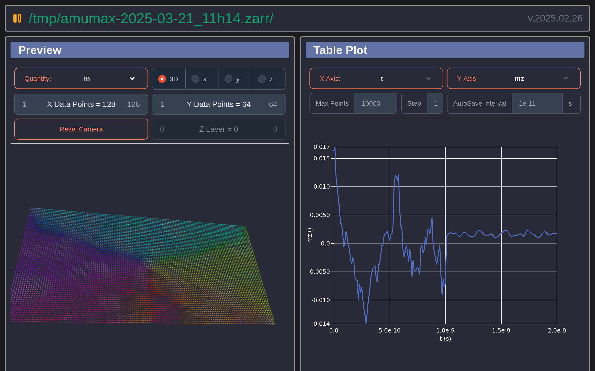
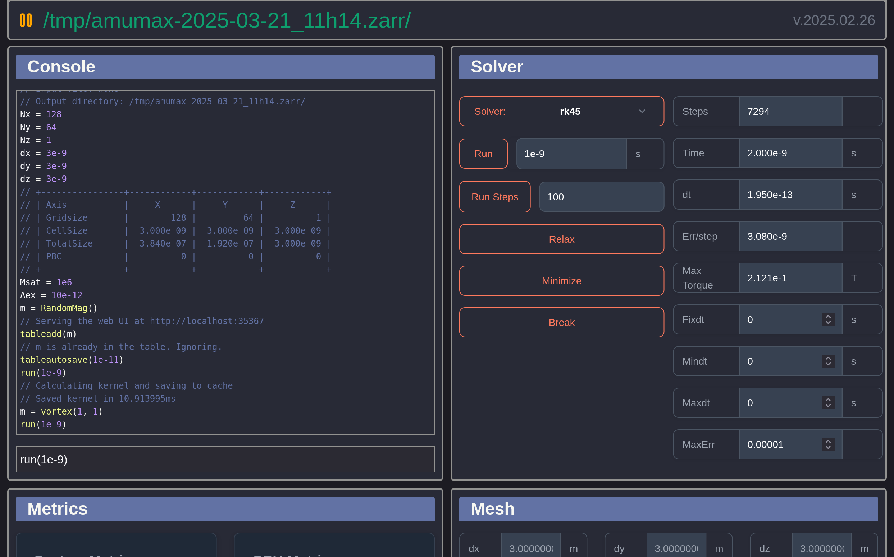
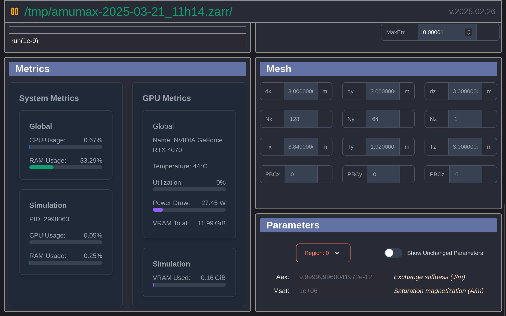

# Amumax

Fork of [mumax3](https://github.com/mumax/3) aimed at enhancing Python workflow integration. Includes improved WebUI and uses [pyzfn](https://github.com/MathieuMoalic/pyzfn) to leverage Zarr-formatted data, making output processing significantly more efficient.

Solvers and results are unchanged, but there are many quality-of-life improvements for data handling. Note that `.mx3` file compatibility is not 100%—see changes below.


---

--- 


- [Installation](#installation)
- [Usage](#usage)
- [Differences from mumax3](#differences-from-mumax3)
- [Building from Source](#building-from-source)
- [Contribution](#contribution)
- [Advantages of Using Zarr Format over OVF Format](#advantages-of-using-zarr-format-over-ovf-format)


## Installation

### Linux

#### Install Script

Don't just run any script from the internet. [Read it](https://raw.githubusercontent.com/MathieuMoalic/amumax/main/install.sh), check what it does, and then you can run this command to install amumax:

```bash
sh -c "$(curl -fsSL https://raw.githubusercontent.com/MathieuMoalic/amumax/main/install.sh)"
```

#### Manually

Download [cufft](https://developer.download.nvidia.com/compute/cuda/redist/libcufft/linux-x86_64/) and [curand](https://developer.download.nvidia.com/compute/cuda/redist/libcurand/linux-x86_64/), unpack, and add the shared objects to `$PATH`, or just install the full CUDA suite with your package manager.

Download the latest [release](https://github.com/MathieuMoalic/amumax/releases/):

```bash
curl -L https://github.com/mathieumoalic/amumax/releases/latest/download/amumax > amumax
chmod +x amumax
./amumax -v
```

`libcurand.so` and `libcufft.so` must either be in the same folder as `amumax` or in `$PATH`.

### Windows

- Get Linux: https://learn.microsoft.com/en-us/windows/wsl/install
- Follow the steps above.

## Usage

Amumax can be run from the command line with various options and subcommands. Below is a description of the available commands and flags.

### Command Line Options

Usage: `amumax [options] [mx3 paths...]`

**Options:**

- `-d`, `--debug`: Debug mode.
- `-v`, `--version`: Print version information.
- `--vet`: Check input files for errors but don't run them.
- `--update`: Update the amumax binary from the latest GitHub release.
- `-c`, `--cache <dir>`: Kernel cache directory (empty disables caching). Default: `$(TMPDIR)/amumax_kernels`.
- `-g`, `--gpu <number>`: Specify GPU. Default: `0`.
- `-i`, `--interactive`: Open interactive browser session.
- `-o`, `--output-dir <dir>`: Override output directory.
- `--paranoid`: Enable convolution self-test for cuFFT sanity.
- `-s`, `--silent`: Silent mode (backwards compatibility).
- `--sync`: Synchronize all CUDA calls (debug).
- `-f`, `--force-clean`: Force start, clean existing output directory.
- `--skip-exist`: Don't run the simulation if the output directory exists.
- `--progress`: Show progress bar (default: true).
- `-t`, `--tunnel <host>`: Tunnel the web interface through SSH using the given host from your SSH config. An empty string disables tunneling.
- `--insecure`: Allows running shell commands.

**Web Interface Options:**

- `--webui-enable`: Whether to enable the web interface (default: true).
- `--webui-host <host>`: Host to serve web GUI (e.g., `0.0.0.0`). Default: `localhost`.
- `--webui-port <port>`: Port to serve web GUI. Default: `35367`.
- `--webui-queue-host <host>`: Host to serve the queue web GUI (e.g., `0.0.0.0`). Default: `localhost`.
- `--webui-queue-port <port>`: Port to serve queue web GUI. Default: `35366`.

### Subcommands

#### `template`

Amumax includes a powerful template system that allows you to generate multiple simulation files (`.mx3`) based on parameter sweeps. This feature simplifies the process of running simulations with varying parameters without manually creating multiple files.

**Usage:**

```bash
amumax template [options] <template path>
```

**Options:**

- `--flat`: Generate flat output without subdirectories.

**Arguments:**

- `<template path>`: Path to the template file.

### Template Strings

#### Syntax

Template strings are placeholders within your `.mx3` files that define how parameters should vary across generated files. The syntax for a template string is:

```go
"{key1=value1;key2=value2;...}"
```

Each template string is enclosed in `"{...}"` and contains key-value pairs separated by semicolons.

#### Available Keys

- **array**: Define a specific set of values.
  - Example: `array=[1,2,3]`
- **start**, **end**, **step**: Define a range of values using start, end, and step (similar to `numpy.arange`).
  - Example: `start=0;end=1;step=0.1`
- **start**, **end**, **count**: Define a range of values with a specific count (similar to `numpy.linspace`).
  - Example: `start=0;end=1;count=5`
- **prefix**: A string to be added before the value in the generated filenames.
  - Example: `prefix=param_`
- **suffix**: A string to be added after the value in the generated filenames.
  - Example: `suffix=_test`
- **format**: Specifies the formatting of the value in the filename (must be a float format like `%f`).
  - Example: `format=%.2f`

#### Examples

##### Example 1: Varying a Single Parameter

**Template File (`template.mx3`):**

```go
Aex := "{start=0;end=2;step=1}"
```

**Command:**

```bash
amumax template template.mx3
```

**Generated Files:**

- `0.mx3`
- `1.mx3`
- `2.mx3`

**Explanation:**

- The placeholder `{start=0;end=2;step=1}` is replaced with values from `0` to `2` in steps of `1`.
- For each value, a new `.mx3` file is generated with the value assigned to `Aex`.

##### Example 2: Using an Array of Values and Formatting

**Template File (`template.mx3`):**

```go
x := "{array=[1,2,3];format=%02.0f}"
```

**Command:**

```bash
amumax template template.mx3
```

**Generated Files:**

- `01.mx3`
- `02.mx3`
- `03.mx3`

**Explanation:**

- The placeholder `{array=[1,2,3];format=%02.0f}` is replaced with each value in the array.
- The `format=%02.0f` ensures that the values in the filenames are formatted with at least two digits, padding with zeros if necessary.

##### Example 3: Combining Multiple Template Strings

**Template File (`template.mx3`):**

```go
x := "{prefix=alpha; array=[1,2];format=%02.0f}"
y := "{prefix=beta; array=[3,4];format=%.0f}"
```

**Command:**

```bash
amumax template template.mx3
```

**Generated Files:**

- `alpha01/beta3.mx3`
- `alpha01/beta4.mx3`
- `alpha02/beta3.mx3`
- `alpha02/beta4.mx3`

**Explanation:**

- All combinations of `x` and `y` values are generated.
- Each combination results in a new `.mx3` file with the corresponding values assigned.

##### Example 4: Using Flat Output

**Template File (`template.mx3`):**

```go
x := "{array=[1,2];format=%02.0f}"
y := "{array=[3,4];format=%.0f}"
```

**Command:**

```bash
amumax template --flat template.mx3
```

**Generated Files:**

- `013.mx3`
- `014.mx3`
- `023.mx3`
- `024.mx3`

**Explanation:**

- The `--flat` option generates files without creating subdirectories.
- Filenames are concatenated with the formatted values.

##### Example 5: Using Prefix and Suffix

**Template File (`template.mx3`):**

```go
Temperature := "{prefix=T; array=[300,350]; suffix=K; format=%.0f}"
```

**Command:**

```bash
amumax template template.mx3
```

**Generated Files:**

- `T300K.mx3`
- `T350K.mx3`

**Explanation:**

- The `prefix` and `suffix` keys add strings before and after the value in the filename.
- The `format=%.0f` ensures no decimal places are included.

#### Notes

- **Formatting:** Only `%f` float formats are allowed in the `format` key (e.g., `%.2f`, `%03.0f`). Formats like `%d` are not allowed.
- **Error Handling:** The template parser will report errors if the syntax is incorrect or required keys are missing.
- **Variables Replacement:** Inside the `.mx3` files, the placeholders are replaced with the numerical values.

#### Advanced Example

**Template File (`template.mx3`):**

```go
alpha := "{prefix=alpha_; array=[0.01, 0.02, 0.03]; format=%.2f}"
beta := "{prefix=beta_; start=0.1; end=0.3; step=0.1; format=%.1f}"
```

**Command:**

```bash
amumax template template.mx3
```

**Generated Files:**

- `alpha_0.01/beta_0.1.mx3`
- `alpha_0.01/beta_0.2.mx3`
- `alpha_0.01/beta_0.3.mx3`
- `alpha_0.02/beta_0.1.mx3`
- ...

**Explanation:**

- Generates all combinations of `alpha` and `beta`.
- Each generated file contains the `alpha` and `beta` values replaced in the `.mx3` file.

## Differences from mumax3

### New Way to Define the Mesh

`Tx`, `Ty`, `Tz`, `Nx`, `Ny`, `Nz`, `dx`, `dy`, `dz`, `PBCx`, `PBCy`, `PBCz` are now predefined variables. You define the Mesh through them. You don't need to call a function to initiate the Mesh; it is automatically done the first time you run a solver, but you can't redefine the Mesh after that!

`Tx` is the total size along the x-axis. `Nx` is the number of cells along the x-axis. `dx` is the size of each cell along the x-axis. Keep in mind that variables in mx3 script files aren't case-sensitive, so `tx` is like `Tx`, for example.

**Old:**

```go
SetGridSize(256,256,10)
SetCellSize(1e-9,1e-9,1e-9)
SetPBC(32,32,0)
```

**New:**

```go
Nx = 256
Ny = 256
Nz = 10
dx = 1e-9
dy = 1e-9
dz = 1e-9
PBCx = 32 // Optional
PBCy = 32 // Optional
PBCz = 0  // Optional
```

**Alternative but equivalent:**

```go
Nx = 256
Ny = 256
Nz = 10
Tx = 256e-9
Ty = 256e-9
Tz = 10e-9
PBCx = 32 // Optional
PBCy = 32 // Optional
```

### Variables That You Define Are Automatically Saved

```go
lattice_constant := 500e-9
ref_paper := "X et al. (2023)"
```

You can access it in the file `.zattrs`, or using [pyzfn](https://github.com/MathieuMoalic/pyzfn):

```python
print(job.lattice_constant)
print(job.ref_paper)
```

### Saving Data by Chunks

Amumax allows you to save simulation data in chunks, which can significantly improve data access performance when working with large datasets. Chunking is particularly useful when you need to read or process specific parts of your data without loading the entire dataset into memory.

#### What is Chunking?

Chunking divides your data into smaller, more manageable pieces called "chunks." When data is stored in chunks, you can access or process only the chunks you need, which reduces memory usage and increases efficiency, especially for large multidimensional datasets.

#### Why Use Chunking?

- **Efficient Data Access**: Quickly read or write specific parts of your data.
- **Reduced Memory Usage**: Load only the required chunks into memory.
- **Improved Performance**: Faster data processing, especially for operations on subsets of the data (e.g., a single layer or component).

#### How to Use Chunking in Amumax

Amumax provides functions to save data with custom chunking configurations:

- `SaveAsChunk(q Quantity, name string, rchunks RequestedChunking)`
- `AutoSaveAsChunk(q Quantity, name string, period float64, rchunks RequestedChunking)`

You can define the chunking strategy using the `Chunk(x, y, z, c int)` function, where:

- `x`, `y`, `z` specify the number of chunks along the respective spatial dimensions.
- `c` specifies the number of chunks for the components (e.g., `mx`, `my`, `mz`).

**Note**: The number of chunks must be divisors of the dataset dimensions. If not, Amumax will automatically adjust the number of chunks to the closest valid value.

#### Example: Saving Magnetization Data in Chunks

```go
Nx = 16
Ny = 32
Nz = 10
Tx = 16e-9
Ty = 32e-9
Tz = 10e-9
SetGeom(Universe())
sampling_interval = 5e-12
AutoSaveAsChunk(m, "m_chunked", sampling_interval, Chunk(1, 1, Nz, 3))
Run(1e-9)
```

In this example:

- **Grid Size**: `Nx = 16`, `Ny = 32`, `Nz = 10`
- **Chunking Strategy**:
  - `x` dimension: 1 chunk (i.e., no chunking along `x`)
  - `y` dimension: 1 chunk (i.e., no chunking along `y`)
  - `z` dimension: 10 chunks (one for each layer along `z`)
  - Components (`c`): 3 chunks (each component `mx`, `my`, `mz` is saved separately)

**Explanation**:

- By setting `Chunk(1, 1, Nz, 3)`, the data is chunked along the `z` dimension into 10 chunks (one per layer).
- Each component (`mx`, `my`, `mz`) is stored in separate chunks.
- This configuration is ideal when you frequently need to access data from specific layers or components.

#### Additional Examples

##### Example 1: Chunking Only Along Components

```go
AutoSaveAsChunk(m, "m_components_chunked", sampling_interval, Chunk(1, 1, 1, 3))
```

- **Chunking Strategy**:
  - Spatial dimensions (`x`, `y`, `z`): Not chunked (single chunk across each dimension)
  - Components (`c`): 3 chunks (separate chunks for `mx`, `my`, `mz`)

**Use Case**: Useful when you need to access individual components without loading the entire vector field.

##### Example 2: Chunking Along All Dimensions

```go
AutoSaveAsChunk(m, "m_fully_chunked", sampling_interval, Chunk(4, 4, 5, 3))
```

- **Chunking Strategy**:
  - `x` dimension: 4 chunks
  - `y` dimension: 4 chunks
  - `z` dimension: 5 chunks
  - Components (`c`): 3 chunks

**Note**: The number of chunks must evenly divide the corresponding dimension size. If not, Amumax will adjust the chunk numbers.

**Use Case**: Optimal when processing localized regions or performing parallel computations on chunks.

##### Example 3: Chunking with Automatic Adjustment

Suppose you specify chunk numbers that don't evenly divide the dimension sizes:

```go
AutoSaveAsChunk(m, "m_auto_adjusted_chunked", sampling_interval, Chunk(3, 5, 7, 3))
```

- If `Nx = 16`, `Ny = 32`, `Nz = 10`:
  - Amumax will adjust the chunk numbers to the closest valid divisors of the dimension sizes.
  - For example, `3` may be adjusted to `4` for `x` if `Nx` is `16` (since `16` is divisible by `4` but not by `3`).

**Tip**: Check the log messages for any adjustments made by Amumax.

#### Accessing Chunked Data with Pyzfn
Loading chunked or unchunked data is similar. Using the [pyzfn](https://github.com/MathieuMoalic/pyzfn) library, you can efficiently load and process chunked data in Python:

```python
from pyzfn import Pyzfn

# Load the simulation job
job = Pyzfn('simulation.zarr')

# For example, load the top layer of 'my' component
my_top_layer = job.m_chunked[0, -1,:,:,1]
```

**Benefits**:

- Load only the necessary data into memory.
- Faster data processing, especially when working with large simulations.

#### Best Practices for Chunking

- **Align Chunk Sizes with Access Patterns**: Choose chunk sizes that match how you plan to access the data. If you often access data along a particular dimension, consider chunking along that dimension.
- **Avoid Too Small or Too Large Chunks**: Very small chunks (<1MB) can lead to overhead, while very large chunks may negate the benefits of chunking.
- **Monitor Performance**: Experiment with different chunking strategies to find the optimal configuration for your specific use case.

### Other Changes

- Removed the Google trackers in the GUI.
- Added saving as Zarr.
- Renamed the functions to save `.ovf` files as `SaveOvf` and `SaveOvfAs`. You cannot autosave OVF files anymore.
- Added progress bar for `Run`; can be turned off with `--progress=false`.
- Reordered GUI elements.
- Dark mode GUI.
- Checks and warns the user for unoptimized mesh.
- `AutoMeshx = True`, `AutoMeshy = True`, and `AutoMeshz = True` will optimize the corresponding mesh axis for you (this function slightly changes the size and number of cells while keeping the total size of the system constant).
- Added chunking support as per the [Zarr](https://zarr.readthedocs.io/en/stable/) documentation with the functions:
  - `SaveAsChunk(q Quantity, name string, rchunks RequestedChunking)`
  - `AutoSaveAsChunk(q Quantity, name string, period float64, rchunks RequestedChunking)`
- `Chunk(x, y, z, c int) -> RequestedChunking` chunks must fit an integer number of times along the axes. The chunks will be modified to be valid and as close as possible to the chunks you requested.
- Added the `ShapeFromRegion` function.
- Added new shapes: `squircle`, `triangle`, `rtriangle`, `diamond`, and `hexagon`.
- Added the `AutoSaveAs` function.
- Added the `Round` function from the math library.
- Added metadata saving: `root_path`, `start_time`, `dx`, `dy`, `dz`, `Nx`, `Ny`, `Nz`, `Tx`, `Ty`, `Tz`, `StartTime`, `EndTime`, `TotalTime`, `PBC`, `Gpu`, `Host`.
- Added `MinimizeMaxSteps` and `MinimizeMaxTimeSeconds` to timeout long `Minimize()` runs.
- Every time the function `Save` is used (from `AutoSave`, for example), the current simulation time `t` is saved too as a Zarr attribute.
- Save compressed arrays (Zstandard) by default.
- `ext_makegrains` now also takes a new argument `minRegion`. `ext_makegrains(grainsize, minRegion, maxRegion, seed)`
- Added colors for terminal logs.

## Building from Source

### Using `nix`:

```bash
nix run .#git
```

### Using `podman` or `docker`:

```bash
git clone https://github.com/MathieuMoalic/amumax
cd amumax
podman run --rm -v $PWD:/src docker.io/oven/bun:1.1.27 bash -c "cd /src/frontend && bun run build && mv /src/frontend/dist /src/api/static"
podman build -t matmoa/amumax:build .
podman run --rm -v $PWD:/src matmoa/amumax:build
./build/amumax -v
```

The amumax binary and CUDA libraries are then found in `build`.

### Manually

You need to install `git`, `bun`, `go`, `cuda`. Then:

```bash
git clone https://github.com/MathieuMoalic/amumax
cd amumax
cd frontend
bun install
bun run build
cd ..
mv frontend/dist api/static
export CGO_LDFLAGS="-lcufft -lcuda -lcurand -L/usr/local/cuda/lib64/stubs/ -Wl,-rpath -Wl,\$ORIGIN" 
export CGO_CFLAGS_ALLOW='(-fno-schedule-insns|-malign-double|-ffast-math)'
go build -v .
```

## Contribution

I'm happy to consider any feature request. Don't hesitate to submit issues or PRs.

## Advantages of Using Zarr Format over OVF Format

Saving data in the Zarr format offers several advantages over the traditional OVF (OOMMF Vector Field) format used by OOMMF:

- **Efficient Data Storage with Compression**: Zarr supports chunked and compressed storage of n-dimensional arrays. Compression is particularly beneficial when much of the simulation data is uniform or contains repetitive patterns, as it significantly reduces the file size. This not only saves disk space but also improves I/O performance because less data needs to be read from or written to disk.

- **Faster Data Access**: By utilizing chunking, Zarr enables faster access to specific subsets of data. You can read or write only the parts of the data you need, significantly improving performance when working with large simulations or analyzing specific regions or components.

- **Parallel Read and Write**: Zarr is designed for distributed and parallel computing environments. It allows multiple processes or threads to read from or write to the same dataset concurrently, greatly speeding up data processing workflows and making efficient use of multi-core processors.

- **Seamless Integration with Python Ecosystem**: Zarr integrates well with Python libraries such as NumPy, Dask, and xarray. This facilitates data analysis, visualization, and processing within Python-based workflows, leveraging powerful tools for handling large datasets.

- **Enhanced Metadata Handling**: Zarr stores metadata alongside the data in a structured format. This makes it easier to keep track of simulation parameters, units, and other important information, improving data provenance and reproducibility.

- **Flexibility and Scalability**: Zarr's design allows it to scale from small to extremely large datasets. It's compatible with various storage systems, from local disk storage to cloud-based object stores (like Amazon S3), providing flexibility in how and where you store your data.

- **Supports Various Data Types**: Zarr allows the creation of N-dimensional arrays with any NumPy data type (`dtype`), providing flexibility in representing different kinds of simulation data.

- **Organized Data Structures**: Zarr can organize arrays into hierarchies via groups, similar to directories and files, making it easier to manage complex datasets.

In contrast, the OVF format lacks native support for chunking, compression, and parallel I/O operations, which can lead to inefficiencies when dealing with large datasets. OVF files often require loading the entire dataset into memory for processing, making it less suitable for large-scale simulations or when only specific portions of the data are needed. Additionally, OVF's integration with modern data analysis tools and workflows is more limited compared to Zarr.

---